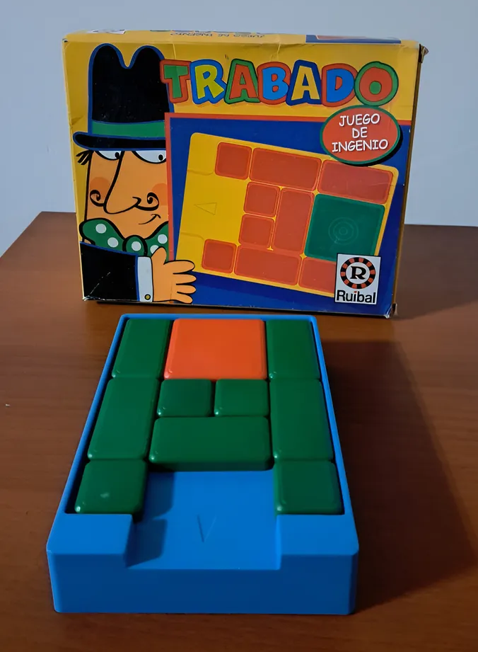
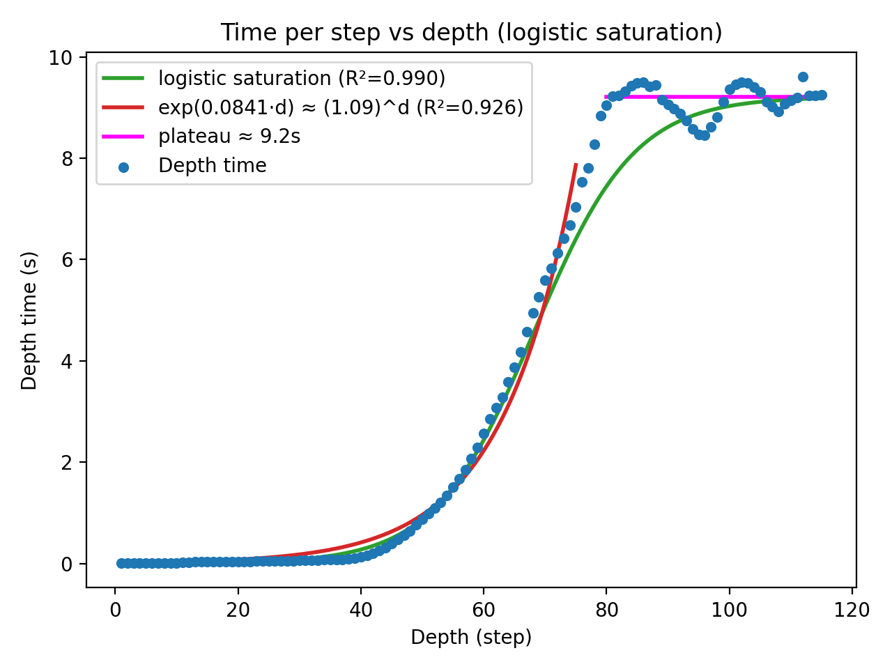

# Ruibal "Trabado" Puzzle Solver

Optimized brute-force solver for the Ruibal "Trabado" sliding puzzle using BFS. The core logic lives in `solver.py` and uses Numba-accelerated move validation to explore the state space efficiently.

<p align="center">
  
</p>

## Game rules:
- **Players:** 1
- **Board:** A rectangular tray containing multiple blocks, with a **single exit notch** on the **bottom edge** (marked with a **“V”** on the blue frame).
- **Target piece:** The **big square block** (the orange in the game, the green in box).
- **Goal:** **Slide the big square block out of the tray through the bottom “V” exit.**
- **Legal moves:**
  - Blocks **slide** inside the tray.
  - Moves are **straight** (up/down/left/right), staying flush with the tray walls/other blocks.
  - Blocks **cannot be lifted** out of the tray during play.
  - Blocks **do not rotate**, their orientation stays fixed.
- **Win condition:** The puzzle is solved when the **big square block has fully exited** through the bottom notch.

## Requirements
- Python 3
- Python packages: `numpy`, `numba`, `matplotlib` (see `docker/requirements.txt`)
- Optional: FFmpeg for `.mp4` output (falls back to GIF if missing)

## Configuration
- `OUTPUT_FOLDER`: path where the solver writes outputs (commonly set via `docker-compose`). The solver creates this folder if it does not exist and writes the solution movie to it.

## Run with Docker Compose (recommended)
1. Set a host output path (defaults to `./output` in `.env` via `OUTPUT_FOLDER_HOST`).
2. Build and run:
   ```bash
   docker compose up --build
   ```
3. Outputs will be written to the host folder mapped to `OUTPUT_FOLDER_HOST`.
4. Logs will not appear in the console, but you can check them with:
   ```bash
   docker compose logs -f
   ```

## Run locally (venv + pip)
```bash
python -m venv .venv
source .venv/bin/activate
pip install -r docker/requirements.txt
export OUTPUT_FOLDER=./output
python solver.py
```

## Outputs
- Console logs per BFS depth:
  - frontier size
  - visited count
  - removed duplicates
  - time spent per depth
- Optional saved solution movie written to `$OUTPUT_FOLDER/`:
  - `solution.mp4` when FFmpeg is available
  - `.gif` fallback otherwise

Example log line format:
```
Depth    <d> --- Frontier boards: <n> --- Visited boards: <n> --- Removed (already visited): <n> --- Depth time: <seconds>s
```

## How it works
- This is an optimized brute-force solver using BFS (breadth-first search).
- The search expands layer-by-layer, where depth equals the number of moves from the initial board.
- Move generation is restricted to pieces adjacent to empty cells.
- Fast move validation and board updates are implemented with Numba `@njit`.
- State deduplication uses `board.tobytes()` keys:
  - dedupe within the next layer (`unique_next`)
  - global visited set across all depths (`visited_keys`)

## Performance plot: time per BFS depth
<p align="center">
  
</p>

### Runtime per BFS depth (optimized brute-force)

This plot shows the **wall-clock time spent to process each BFS “depth”** (i.e., one full layer of states that are exactly *d* moves away from the initial board). Each blue dot is the measured time for one iteration of the main loop:

- expand the current frontier (`expand_unique_frontier`)
- generate candidate moves (only for **pieces adjacent to an empty cell**)
- apply/validate moves with **Numba-compiled** `move_piece`
- deduplicate states **within the layer** and **across all previous layers** using a hashable `board.tobytes()` key
- scan the new frontier for a solved board (`is_solved`)

#### What the curve is telling you
- **Early depths are cheap** (near 0s): the frontier is small, so there are few boards to expand.
- **Mid depths grow fast** (~40–75): the frontier size ramps up quickly, so per-depth time looks *approximately exponential* at first (red curve, ≈ \(1.09^{d}\)).
- **Later depths saturate** (≥ ~75): because the puzzle has a **finite number of reachable board states** and duplicates are aggressively removed, the frontier can’t keep growing forever. The per-depth runtime approaches a steady **plateau around ~9.2s** (magenta), which is captured extremely well by a **logistic saturation** model (green curve, \(R^2 \approx 0.99\)).

#### Takeaway
Even though brute-force BFS *starts* like exponential growth, the combination of **move pruning (adjacent-to-empty only)** + **fast move evaluation (Numba)** + **state deduplication (visited set)** pushes the search into a **steady-state regime** where each additional BFS layer costs roughly a constant amount of time (here ~9s on the measured machine), with small oscillations coming from how “move-rich” the frontier boards are at that depth. **The total runtime was 457.8 seconds** to reach the solution at depth 115, and because it uses BFS, **this is guaranteed to be the shortest solution.**

## Troubleshooting
- Numba first-run compilation overhead: the first depth may be noticeably slower as kernels compile.
- Missing or invalid `OUTPUT_FOLDER`: set it to a writable path before running.
- FFmpeg not installed: the solver will save a `.gif` instead of `.mp4`.

## License
MIT License. See `LICENSE` file for details.
